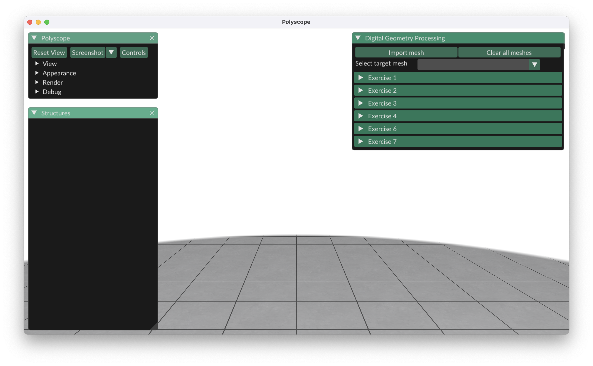

# Digital Geometry Processing, Fall 2024

Welcome to Digital Geometry Processing! In this class, we will be implementing various algorithms on geometric data. The weekly assignments will be implemented with the help of three (extremely popular!) libraries: [Geometry Central](https://geometry-central.net/surface/geometry/geometry/) (for manipulation of geometric data), [Polyscope](https://polyscope.run/) (for visualization of said data), and [Eigen](https://eigen.tuxfamily.org/index.php?title=Main_Page) (for numerical linear algebra) . We will use this repo for all course assignments. It will be updated by the course staff at certain points during the semester. We will provide instructions on how to update your local copy (should be no harder than running `git pull` in your terminal).

## Build Intructions

Detailed build instructions can be found on Piazza in the [Environment Setup Intructions](https://piazza.com/class_profile/get_resource/m01695s4yau24l/m0h7tfi6r9b4c2) handout. Assuming you now have acccess to a Unix-like system (Linux, macOS, Windows Subsystem for Linux), we will quickly run through the build intstructions here. `cd` to an accessible directory on your computer and clone this repo. 

`git clone https://github.com/dscrivener/DGP`

Navigate to the newly created folder and make a build directory for build files. 

`mkdir build; cd build`

Run the CMake command to generate the build files 

For Macs with Apple Silicon: `cmake -DCMAKE_APPLE_SILICON_PROCESSOR=arm64 ..`

For Anything else: `cmake ..`

Run make to build the project. The first compilation may take a few minutes; any subsequent build should only re-compile the files you’ve changed. You can speed this up by using the -j flag to specify the number of threads to use, e.g.
 
`make -j10`

Finally, we can run the executable located at `./build/bin/DGP` where `.` is the root of this repo. For example, if you're in the `/build` folder, you would 
run 

`./bin/DGP`

If everything is succesful, you should see a pop-up window in the top right with menus for loading meshes and controlling various assignments. **Get started with the installations early** so the course staff can help you troubleshoot any issues you run into. 

## Assignments

For every assignment, you will edit the boilerplate code provided to you in a particular file. These files will be located in the `src/` directory named according to the corresponding assignment number. For example, in Exercise 1, you will edit code in the `src/ex1.cpp` file and, if desired, its corresponding header `src/include/ex1.h`. **We ask that you do not edit other files**, as we will be updating this repo throughout the semester and don't want to run into [merge conflicts](https://www.perforce.com/blog/vcs/what-is-a-merge-conflict-git) down the line.

Please feel free to reach out to the course staff with any questions!

## Acknowledgements

[Lucas Cui](https://github.com/Lucascuibu) was greatly helpful in providing the infrastucture for this repo. In particular:
- Constructed the "panel" interface
- Provided skeleton versions of each assignment
- Wrote container class for coordinating mesh access

All assignments are adapted from those of the [3D Geometry Processing](https://cgg.unibe.ch/course/50/) course at University of Bern. Thanks to David Bommes & the Computer Graphics Group at U. of Bern for sharing these resources!

This repository is adapted from `gc-polyscope-project-template` [(link)](https://github.com/nmwsharp/gc-polyscope-project-template) and relies heavily on the [Geometry Central](https://github.com/nmwsharp/geometry-central/) & [Polyscope](https://github.com/nmwsharp/polyscope) libraries. The interface also makes use of [ImGuiFileDialog](https://github.com/aiekick/ImGuiFileDialog). Many thanks to the developers and maintainers of these projects! 